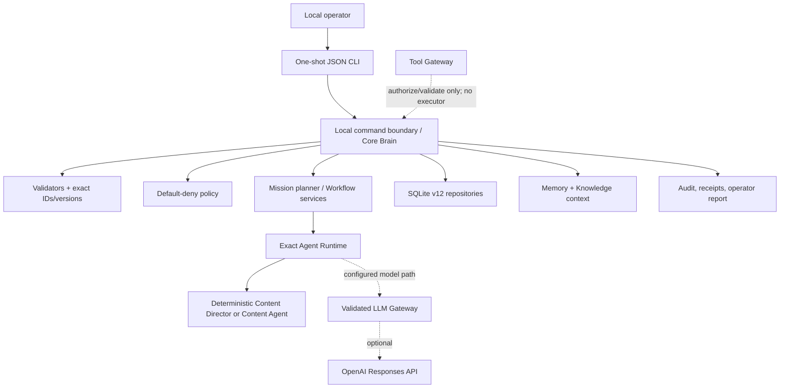
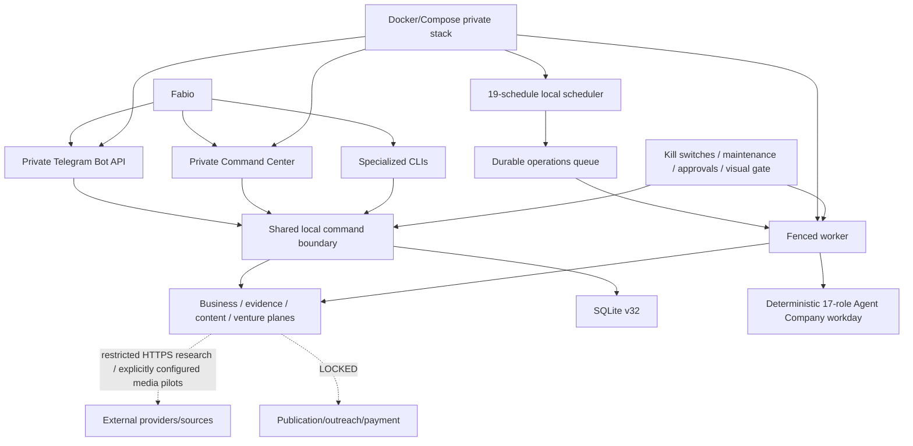

# MV-AI-OS — Complete Project Intelligence Dossier

**Analysis date:** 2026-08-13 (Europe/Rome)

**Authoritative checkout:** `/Users/onlyway24/AI/MV-AI-OS` (physical worktree `/Users/onlyway24/Desktop/MV-AI-OS`)

**Branch / HEAD:** `main` / `901c126c3104351b212f6aad1ecc3b0bc4b263c0` (`v1.0.1-core`, equal to `origin/main`)
**Important scope note:** HEAD is not the whole analyzed state. The `main` worktree contains a substantial, tested but uncommitted Core V1 hardening/admission change set. The clean branch `feature/telegram-operator-console` at `3b8389d4fa540a983b11b86b9b5182ea6389363a` is 36 commits ahead of `main` and contains the private console, Telegram, business, H24 and production work. None of that branch is integrated into `main`.

## Evidence convention

Claims use these labels:

- **VERIFIED** — demonstrated directly by source, configuration, Git metadata, local artifact metadata, or a previously executed test result for the exact analyzed worktree.
- **PARTIALLY VERIFIED** — implementation exists, but a required live, host, browser, credential, or operational checkpoint was not observed.
- **DOCUMENTED ONLY** — stated in documentation without sufficient implementation or runtime evidence.
- **INFERRED** — a conservative conclusion from multiple artifacts, identified as inference.
- **NOT FOUND** — searched for and not found in the relevant state.
- **STALE / CONFLICTING** — contradicted by code, Git state, or newer evidence.

Unless explicitly qualified as “advanced branch”, statements about “current” behavior refer to `main` plus its uncommitted change set. Tests prove only their asserted properties; they are not treated as deployment evidence.

---

## 1. EXECUTIVE SUMMARY

MV-AI-OS is a local-first, contract-first operating system for governed AI work. Its architectural thesis is that missions, workflows, agents, model calls, approvals, evidence and external effects must be explicit, bounded, attributable, versioned and durable. The human operator—Fabio in the domain language—remains the authority for consequential decisions.

**VERIFIED — current `main`:** the project has a strong deterministic Core V1. A bounded JSON CLI can validate and plan a Founder Mission, admit or create a durable workflow, collect exact approval and Guardian evidence, select one eligible step, invoke one deterministic Content Director, persist and inspect the result, require explicit acceptance, complete the workflow, recover after restart, and expose audit/report evidence. SQLite schema v12, default-deny policy, memory, knowledge, OpenAI Responses API wiring, controlled backup/restore, and extensive tests are present.

**VERIFIED — what `main` is not:** it has no HTTP server, dashboard, Telegram transport, background scheduler, H24 worker, direct tool execution, publication, outreach, payment, multi-user authentication, cloud deployment, or autonomous replanning. Its CLI is a one-request/one-response process. Time passing alone performs no work.

**VERIFIED — advanced branch:** `feature/telegram-operator-console` is a coherent descendant of `main`, not an abandoned unrelated experiment. It adds 596 changed files, roughly 105k lines, schema v32, a private Command Center, Telegram Bot API operator, deterministic 17-role Agent Company, business/content/research/venture planes, a 19-job supervised scheduler/worker, social OAuth foundations, real bounded media-provider pilots, Docker/Compose/VPS release engineering, passkey administration and extensive offline tests. It is clean and remote-tracked.

**PARTIALLY VERIFIED — advanced branch maturity:** the branch is implemented and heavily tested offline, but repository evidence explicitly refuses to claim that an H24 process, VPS release, OAuth connection, private-phone acceptance, publication, payment activation or external business effect is currently active. Publication and other consequential actions are locked. The latest branch state says Venture #001 is `AWAITING_FABIO / EVIDENCE_INSUFFICIENT`; its Agent Company acceptance truthfully ends with 16 completed work items and Backup Guardian blocked pending a real restore receipt.

The strongest architectural property is the durable, fail-closed control model: immutable specifications and fingerprints, exact versions, transactional receipts, replay/conflict handling, separation between invocation and acceptance, and explicit recovery. The largest technical risk is integration/state divergence: the most capable system lives on a long-lived feature branch while `main` has a different uncommitted hardening line; a local v32 database cannot be opened by `main` v12. A naïve merge, branch switch, or runtime start could therefore lose capabilities or hit an intentional schema-version stop.

The next major leap is not another surface. It is a controlled integration program: first preserve and commit the Core hardening, then reconcile it into the advanced branch, prove schema/data migration and all release gates, and promote one authoritative branch. Only afterward should real external-effect tools or higher autonomy be added.

### Current maturity estimate

Scores evaluate **current `main`**, with advanced-branch capability noted separately.

| Area | Score (0–5) | Evidence-based rationale |
|---|---:|---|
| Core architecture | 4.0 | **VERIFIED:** strict TypeScript, inward dependencies, ports, validators, immutable registries, deterministic composition. Integration divergence prevents 5. |
| Persistence | 4.0 | **VERIFIED:** SQLite v12, migrations, application identity, transactions, restart/replay, bounded records, backup/restore. Single-process assumptions remain. |
| Agent runtime | 2.5 | **VERIFIED:** robust exact invocation for two narrow agents; no general multi-agent execution or isolation. |
| Workflow engine | 3.0 | **VERIFIED:** durable state, admission, controls and replay; only one simple admitted DAG and no conditions/dynamic branching/scheduler. |
| Autonomous execution | 0.5 | Operator must issue each Core command. Advanced branch reaches supervised local scheduling but is separate/inactive. |
| Tool execution | 0.5 | Gateway authorizes/validates externally supplied results; it deliberately does not execute tools. |
| LLM/provider integration | 2.5 | **VERIFIED:** official OpenAI adapter, limits, budgets, privacy filtering, fake-tested composition. Live availability is not part of default proof. |
| Security | 3.5 | **VERIFIED:** strong local boundaries and seven fixed scan findings. No multi-tenant isolation; external production posture unverified. |
| Reliability | 3.5 | **VERIFIED:** idempotency, transactions, restart and adversarial tests. No current-main daemon/HA/operational SLOs. |
| Operator control | 3.0 | Exact CLI reports and approvals are solid but laborious. Advanced branch adds strong console/Telegram surfaces separately. |
| Observability | 2.0 | Durable audit/receipts and injected logger; no metrics, tracing, alerting or exporter on `main`. |
| Deployment/H24 | 0.5 | **NOT FOUND on main.** Advanced branch has serious implementation/runbooks, but no locally verifiable active deployment. |
| Business automation | 1.0 | Mission planning is real but non-executing. Advanced branch implements internal business planes, still without verified market effects. |
| Production readiness | 2.0 | Core checks pass, but the checkout is dirty/private and not an installed service. Advanced release controls are separate and operational proof is absent. |

---

## 2. PROJECT IDENTITY AND ORIGINAL GOAL

The initial July 2026 history moves from architecture documents to a strict TypeScript foundation, Core Brain, Content Agent, memory, persistence, LLM gateway, policy, knowledge, specifications, tools and local runtime. The original problem is visible in both the constitution and implementation: coordinate AI work without permitting opaque autonomous action, cost, data leakage or unattributed state mutation.

The core philosophy is:

1. contracts and policy precede execution;
2. durable state and evidence precede claims;
3. agents propose or execute only within an exact specification;
4. external effects live behind separate gateways and approvals;
5. the operator retains revocation, approval and kill authority;
6. deterministic/offline behavior is the acceptance baseline; live providers are additive.

The intended relationship is: a **Mission** captures founder intent; a planner produces a non-executing plan; a **Workflow Specification** defines allowed steps and exact agents; admission binds it to durable workflow state; the **Agent Runtime** invokes an eligible exact agent; **Policy**, approvals and Guardians constrain the operation; **Tools/Providers** are the only future routes to effects; receipts and audit preserve attribution.

**VERIFIED — evolution:** the advanced branch extended the vision from a Core workflow kernel to an “Onlyway” founder operating environment: Telegram and web control, evidence-driven content/business work, a supervised Agent Company, recurring operations, venture holding and production deployment. It did not remove the human authority model. External publication, outreach, spend and deployment remain deliberately separated or blocked.

**Vision vs current capability:** the vision is a high-autonomy, evidence-driven AI operating company. Current `main` is a safe deterministic kernel. The advanced branch is a supervised internal operations system. Neither repository state proves an autonomous, revenue-generating, externally acting company.

---

## 3. CURRENT REPOSITORY STATE

| Item | Observed state | Classification |
|---|---|---|
| Logical root | `/Users/onlyway24/AI/MV-AI-OS` | VERIFIED |
| Physical main worktree | `/Users/onlyway24/Desktop/MV-AI-OS` | VERIFIED |
| Current branch / HEAD | `main` / `901c126c3104351b212f6aad1ecc3b0bc4b263c0` | VERIFIED |
| Upstream relation | `main == origin/main` (`0 ahead / 0 behind`) | VERIFIED |
| Dirty state | 43 tracked files changed (`+2581/-465`) plus admission/build/test additions | VERIFIED |
| Main source/tests/docs | ~318 source files; 89 `*.test.ts`; 23 docs including this dossier | VERIFIED |
| Main history | 85 commits reachable from HEAD; 121 across all refs | VERIFIED |
| Tags | `v0.1.0-alpha`, `v1.0.0-core`, `v1.0.1-core`, `onlyway-live-ai-pilot-baseline-v1` | VERIFIED |
| Package | private `mv-ai-os@0.1.0`, ESM, Node `22.23.x`, npm `10.9.8` | VERIFIED |

### Important branches and worktrees

- `main` — tagged Core baseline plus uncommitted specification-admission and security/build hardening.
- `feature/commercial-proof-ledger` — clean registered worktree at the exact `main` HEAD, tracking `origin/main`; **VERIFIED: no unique commits**, so currently a placeholder, not a separate implementation.
- `feature/telegram-operator-console` — clean registered worktree at `3b8389d`, tracks its remote, contains `main`, is 36 commits ahead and zero behind. It has ~528 source files, 191 `*.test.ts` and 71 docs. **VERIFIED: separate, not merged or superseded.**
- `backup-before-vertical-slice-recovery` at `26005c2` — an ancestor of `main`; **VERIFIED: historical safety branch, functionally superseded**.

The advanced branch changes 596 files relative to `main` (`+105014/-208`). It is the sole repository location for Telegram, Command Center, operations/H24, business/venture, production runtime and VPS deployment code.

### Relevant ignored/local artifacts

Metadata was inspected without reading secrets or mutating databases:

- `config/live-ai-closure.local.json`, `config/openai-responses-conformance.local.json`, `config/openai-text-diagnosis.local.json` — ignored local configurations; **PARTIALLY VERIFIED**, content deliberately not inspected.
- `data/mv-ai-os-core-v1.sqlite` — 1.28 MB, application ID `0x4d564149`, schema/user version 32, 64 application tables. **VERIFIED:** generated by the advanced line. Current `main` supports v12 and should reject this newer database.
- diagnostic SQLite ledgers for live AI/OpenAI — application ID/version 0 with two tables; **INFERRED:** specialized local ledgers, not Core runtime databases.

No branch was changed and no database was opened writable during this analysis.

---

## 4. ARCHITECTURE MAP

### Current `main`



The CLI adapter bounds JSON and identity. The application layer composes mission and workflow services. Domain contracts know no SQLite, provider or transport. Repository transactions serialize durable mutations. Provider and tool gateways are ports, not implicit privileges. The workflow executor is preparation-only and `externalEffectsAllowed: false`.

### Advanced branch extension



**VERIFIED:** the branch adds real daemon and transport boundaries, but scheduled handlers remain internal/zero-provider by default. The diagram’s external lines are limited, explicitly configured exceptions—not general autonomous network access.

---

## 5. COMPLETE COMPONENT INVENTORY

| Component | Purpose | Status | Entry points | Persistence | External effects | Tests / notes |
|---|---|---|---|---|---|---|
| Core Brain | Route a task through policy, context and agent runtime | Implemented/connected on main | legacy request CLI | tasks, requests, audit | none by default; optional provider | unit/integration |
| Local command boundary | Exact Core V1 operations | Implemented/connected | `mv-ai-os` JSON stdin | command receipts + domain tables | false | restart/replay/CLI tests |
| Founder Mission | Validate founder intent | Implemented | `CREATE_MISSION` | command receipt | none | scenario tests |
| Mission planner + quality gate | Deterministic plan for ten declared roles | Implemented, non-executing | `PLAN_MISSION` | receipt | none | planning lab |
| Workflow specification registry | Immutable exact specs | Implemented in dirty main | admission command | fingerprints in definition/instance | none | focused admission tests |
| Workflow runtime | Lifecycle/readiness/control | Implemented, narrow | 21 workflow operations | 12 workflow table families | none | strong adversarial tests |
| Agent Runtime | Resolve and invoke exact agent | Implemented, narrow | Core Brain / `INVOKE_AGENT` | invocation/event/result | optional LLM for Content Agent; director local | strong narrow coverage |
| Content Agent | Content-domain task response | Implemented | Core Brain task | task/audit; proposed memory only | optional OpenAI | deterministic + fake-provider tests |
| Content Director | Preparation-only workflow result | Implemented | admitted Core V1 workflow | invocation/outcome | none | deterministic/restart tests |
| Agent specifications | Declarative company roles | Implemented declarations | registries/planner | no dedicated state | none | validation/readiness tests |
| Onlyway Assistant | Deterministic orchestration advice | Implemented but not primary UI/runtime loop | direct service/spec | none | none | unit tests |
| Guardians | Cost/security/backup/incident/quality reports | Implemented, supplied-state | services/checkpoints | workflow checkpoint evidence | none | unit/checkpoint tests |
| Policy evaluator | Permission intersection/default deny | Implemented/connected | Core Brain/gateways | audit indirectly | none | policy tests |
| Tool Gateway | Authorize request and validate supplied result | Implemented foundation, no executors | library API | audit via caller | **does not execute** | mocks/in-memory tests only |
| LLM Gateway | Validate profiles, budgets, usage | Implemented/connected optionally | model-backed Content Agent | no durable aggregate ledger | calls provider when configured | fake transport tests |
| OpenAI adapter | Responses API transport | Implemented/optional | configured local runtime | none | HTTPS to official origin | offline/fake tests; local pilot evidence only |
| Memory | Scoped durable context | Implemented/connected | service/Core Brain | `memory_records` | filtered model egress | repository/context tests |
| Knowledge | Scoped evidence/context search | Implemented/connected | service/Core Brain | `knowledge_records` | none | repository/context tests |
| SQLite | Durable local state | Implemented/connected | runtime repositories | schema v12 | filesystem | corruption/restart/migration tests |
| Backup/restore | Coherent SQLite copy/restore | Implemented library boundary | TypeScript API | backup file | filesystem only | race/identity/restore tests |
| Structured logging | Injected logger | Foundation | runtime dependency | no default sink | none | Noop default |
| Telegram | Remote private operator | Advanced branch only | `mv-ai-os-telegram` | Telegram tables, command receipts | Telegram Bot API | extensive offline tests; private-phone acceptance open |
| Command Center | Private operator web surface | Advanced branch only | HTTP CLI, loopback/private tunnel | Core + admin state | HTTP UI; no publication | session/SSE/action tests |
| Admin security | passkeys, CSRF, rate limits, capabilities | Advanced branch only | Command Center | separate admin state | authentication traffic | security tests |
| Agent Company | deterministic 17-role workday | Advanced branch only | workday callback/command | `agent_company_workdays` | none | acceptance ends 16 complete + backup blocked |
| Business Mission | evidence-bound business dossier | Advanced branch only | local commands/Telegram/CC | mission/evidence tables | none | offline E2E |
| Content production | evidence-led Metodo Veloce packages | Advanced branch only | local commands/UI | production tables/queue | publication locked | visual/evidence tests |
| Research runtime | authorized-source acquisition | Advanced branch only | research mission | research/evidence tables | restricted public HTTPS | fake/offline strong; live state not proven |
| Media factory | controlled text/image generation | Advanced branch only | specialized CLIs | local session ledgers/assets | bounded OpenAI calls when explicitly configured | live pilot docs/local ledgers; not default suite |
| Social OAuth foundation | connect Instagram/TikTok apps | Advanced branch only | local connector HTTP/CLI | encrypted owner-only file | OAuth endpoints | fake transport/PKCE tests; browser checkpoint open |
| Social publication | future action plane | Contract/fake only | none production | plans/dry-run | **publicationAllowed: false** | test-only transport |
| Operations scheduler | recurring job materialization | Advanced branch only | operations CLI | schedules/jobs/leases | none itself | scheduler/fencing tests |
| Operations worker | bounded job execution | Advanced branch only | operations CLI | attempts/receipts/usage | default handlers report false | timeout/retry/recovery tests |
| Venture Holding | evidence-based candidate/experiment review | Advanced branch only | venture CLI/jobs | venture tables | locked | Venture #001 evidence insufficient |
| Production closure | readiness/rehearsal/security/payment gates | Advanced branch only | production CLI/scripts | signed receipts/DB/admin backups | host mutations only via scripts | offline/rehearsal tests; live VPS unverified |
| Docker/Compose/VPS | private five-service deployment | Advanced branch only | scripts/systemd/Compose | bind mounts/backups | private networking/SSH | implementation and runbooks; deployment not locally proven |

---

## 6. CORE DOMAIN MODEL

| Concept | Definition, identity and lifecycle | Persistence / invariants |
|---|---|---|
| Mission | Founder intent in a strict 10-field brief; validates before planning | command receipt; deterministic fingerprinting through containing commands |
| Mission Plan | ordered non-executing allocation across declared roles plus quality gate | returned/persisted in receipt; does not grant execution |
| Business Mission | Advanced evidence-bound opportunity/content/business dossier | `business_mission_dossiers`; exact workspace/actor/version; approval states |
| Workflow Specification | immutable versioned DAG declaration referencing exact Agent Specifications | registry + SHA-256 canonical fingerprint; current admission accepts a bounded static subset |
| Workflow Definition | durable derived step graph | `workflow_definitions`; admitted definitions retain provenance/fingerprint |
| Workflow Instance | mutable state machine snapshot | `workflow_instances`; version checked on every control; terminal precedence |
| Agent Specification | immutable role/capability/budget/model contract | registry; exact name/version/fingerprint; status must be active for admission |
| Agent | executable implementation resolved against a specification | runtime registry; current main has Content Agent and deterministic Content Director paths |
| Invocation | reservation and terminal execution evidence | invocation + event tables; unique ID, exact workflow/step/spec; restart validates fingerprint |
| Task | Core Brain request lifecycle | `tasks`, keyed task/workspace/actor; idempotent request fingerprint |
| Run / Execution | No universal aggregate on main; workflow invocation and advanced operations attempt are the real units | **NOT FOUND** as a single generic run model |
| Receipt | immutable replay/attribution record for command, lifecycle, invocation or external boundary | multiple tables; exact IDs, payload fingerprint, result validation, conflict on mismatch |
| Evidence | approval/Guardian/event/provenance records; advanced branch generalizes to packs/records | append-only or versioned; never equivalent to permission unless explicitly consumed |
| Memory | durable scoped context records | visibility, sensitivity, provenance, expiry, deletion, permission tags |
| Ownership | binding of workspace/actor to workflow and command scope | `local_workflow_ownership`; cannot be forged by legacy creation |
| Attribution | exact agent/spec/workflow/version/actor association | fingerprints and receipts across admission/invocation/audit |
| Policy | intersection of actor, task, policy and approval grants | evaluated in memory; decisions reflected in audit/checkpoints |
| Capability | declared bounded action, not an automatic grant | immutable registries/matrices; advanced company capabilities remain internal |
| Tool | schema/permission contract for an action | registry only; no production executors on main |
| Provider | model implementation behind `ModelProvider` | configuration + secret reference; no secret persistence |
| Approval | caller-recorded exact snapshot decision | approval checkpoint + atomic control event; stale versions ignored |
| Budget / Cost | per-request model limits and advanced per-job zero budgets | gateway usage accounting; advanced attempt rollups; no main mission-wide ledger |
| Audit event | redaction-safe correlated immutable evidence | `audit_events` and workflow/advanced event tables |
| Scheduler job | Advanced durable occurrence with lease, attempt, budget and receipt | schedules/jobs/attempts/successors/usage; not present on main |

The central invariant is that names are not authority. Exact identities, versions, canonical fingerprints, policy grants and durable evidence must all match the current snapshot.

---

## 7. AGENT SYSTEM

### Implemented and runtime-reachable on `main`

| Agent | Role / files | Input → output | Provider, memory, tools | Effects / supervision / tests |
|---|---|---|---|---|
| `content@1.0.0` | Content-domain specialist; `src/agents/content/*` | validated `business.content` task → structured `AgentResult` | profile `content-quality`; memory categories conversation/semantic/user; general knowledge; zero tools; deterministic or configured model-backed implementation | no direct effects; one model call max, 2048 output tokens, $0.10, 30 s, 262144-byte result; Core Brain/policy validation; deterministic and fake-provider tests |
| `content-director@1.0.0` | Preparation-only workflow executor; workflow/runtime specs | exact eligible Core V1 step snapshot → bounded direction artifact | deterministic local; no model, memory write, tool, network or filesystem | `externalEffectsAllowed:false`; approval + two Guardians + explicit acceptance; restart/replay/adversarial tests |

### Implemented specifications, not general runtime workers on `main`

The ten-role declarative company comprises Research Agent, Business Agent, Content Director, Developer Agent, Knowledge Curator, Publisher Agent, Sales Agent, Finance/Cost Analyst, Legal/Risk Reviewer and Customer Delivery Agent. Declarations include responsibilities, permissions, handoffs, readiness, max one model call, 2048 output tokens, about $0.08, zero tools and 30 seconds. **VERIFIED:** only the Content Director has an executor in the workflow catalog. The others guide deterministic planning and validation; declaring them `READY` does not make them executable workers.

The Onlyway Assistant specification and its deterministic assistant evaluator, Guardian consultation, operator-decision, delegation-policy and operator-protocol services are implemented and tested. **PARTIALLY VERIFIED:** they are callable library components but are not composed as a self-running main assistant or the primary CLI control loop.

Guardians—Cost, Security, Backup, Incident and Quality—are deterministic report-only components. They inspect sanitized caller-supplied state and cannot poll systems, schedule themselves, repair state or authorize external effects. `operator_safety` aggregates evidence. Workflow checkpoints currently require operator-supplied Guardian decisions.

### Advanced branch: operational Agent Company

The advanced catalog contains 17 roles: Onlyway Assistant; Research; Business; Content Director; Content Producer; Sales; Customer Delivery; Knowledge Curator; Developer; Finance/Cost; Legal/Risk; Publisher; Quality Guardian; Risk Guardian; Cost Guardian; Security Guardian; Backup Guardian.

**VERIFIED:** `OperationalAgentCompanyService` executes a fixed dependency graph sequentially and produces deterministic local outputs using injected internal services. It records a durable workday and applies quality/risk/cost gates. It is not a conversational LLM swarm: no dynamic agent creation, no parallel execution, no direct agent-to-agent calls, no autonomous role choice and no unbounded delegation. Handoffs are data contracts through the orchestrator. Retry is owned by the operations job runtime, not by individual agents.

Global forbidden actions include external contact/email, merge, deploy, public publication, spend, CRM write and destructive mutation. Latest acceptance evidence reports 16 `COMPLETED` items and Backup Guardian `BLOCKED` on `BACKUP_RESTORE_RECEIPT_REQUIRED`; this is intentional truthfulness, not a failing orchestration implementation.

### Planned/documented and legacy

Older `docs/agent-lab` names such as CEO/Review agents and future n8n-based handoffs are design material. They are **DOCUMENTED ONLY** unless mapped to one of the concrete specifications above. No legacy agent executor was found to be secretly runtime-reachable. The duplicate-looking “Content Agent” and “Content Director” are distinct: the first is the original Core Brain specialist; the second is the exact workflow step executor.

---

## 8. AUTONOMY MODEL

| Question | Current main | Evidence |
|---|---|---|
| Generate tasks autonomously | NO | only caller requests create work |
| Plan | PARTIAL | deterministic mission plan on explicit command |
| Decompose a mission | PARTIAL | fixed bounded plan, no adaptive decomposition |
| Re-evaluate its plan | NO | no feedback/replanning loop |
| Create workflows | PARTIAL | operator commands create/admit exact specs |
| Choose agents | PARTIAL | registry resolves a statically referenced exact agent; no strategic choice |
| Invoke providers | PARTIAL | configured model-backed Content Agent can; default deterministic path does not |
| Invoke tools | NO | gateway does not execute |
| Navigate/research | NO | no main network research runtime |
| Write files | DISABLED BY POLICY | backup/restore/config are explicit infrastructure APIs, not agent tools |
| Communicate externally | NO | no transport on main |
| Publish | DISABLED BY POLICY | no implementation |
| Spend money | DISABLED BY POLICY | provider budget exists but no autonomous model loop; other spend absent |
| Schedule work | NO | no timer/worker/scheduler |
| Continue after restart | PARTIAL | durable state and deterministic interrupted invocation recovery; operator restarts and issues commands |
| Function H24 | NO | one-shot CLI only |
| Recover from failure | PARTIAL | explicit classification/eligibility/authorization/retry; no automatic recovery |
| Recognize blockage | YES | readiness/report emits exact blockers and one next action |
| Ask for approval | PARTIAL | reports required action; no outbound notification |
| Modify strategy | NO | fixed planners/executors |

**Advanced branch delta:** scheduling, daemon continuity, restart recovery, internal task generation and Telegram/Command Center notification become **PARTIAL/YES for supervised internal work**. They remain zero-provider by default, require an installed persistent process, and cannot publish, contact customers, spend or deploy autonomously. The branch can safely run its internal job loop for long periods if installed and healthy; repository state does not prove it is installed.

---

## 9. MISSION LOOP / EXECUTION LOOP

### Core V1 controlled loop

1. Operator submits `CREATE_MISSION`; strict validator accepts or rejects the Founder Mission Brief.
2. Operator submits `PLAN_MISSION`; deterministic planner and quality gate produce a non-executing plan.
3. Operator creates a compatible workflow or, in the dirty change set, submits `ADMIT_WORKFLOW_SPECIFICATION` for the exact immutable `core-v1-content-direction@1.0.0` spec.
4. Admission resolves every exact Agent Specification and atomically persists definition, instance, ownership and audit.
5. Operator requests report/readiness; the system derives blockers.
6. Operator records exact Fabio approval and independent `operator_safety` and `quality` Guardian evidence.
7. Operator asks for the next candidate; the boundary rechecks ownership, versions, spec fingerprint, dependencies and controls.
8. Operator invokes the Content Director. Reservation is persisted, execution occurs outside the transaction, and a bounded terminal result is persisted.
9. Operator inspects and explicitly accepts or rejects. Acceptance atomically completes the step/workflow; rejection remains durable without false completion.
10. A new process can reopen SQLite and reproduce state/report/audit.

The autonomous loop ends after each command. There is no implicit transition from planning to admission, readiness to invocation, invocation to acceptance, failure to retry, or wall-clock timeout to evaluation.

### Core Brain content loop

Legacy task request → validate and idempotently persist → route `business.content` → intersect permissions → retrieve authorized memory/knowledge → create one-step plan → deterministic/model-backed Content Agent → validate result → persist task/audit/replay response. Agent-proposed memory is not automatically written.

### Advanced supervised loop

Scheduler lease → materialize due occurrence idempotently → queued job → fenced worker claim/heartbeat → handler execution → bounded receipt/attempt/usage/event → complete, block, retry-schedule, dead-letter or cancel. This loop can repeat without an operator only after the scheduler and worker processes are explicitly installed/started and controls allow it. Handlers operate on internal state; real business/outbound effects remain gated.

---

## 10. WORKFLOW ENGINE

**VERIFIED support on current main:** immutable registries; exact name/version resolution; canonical SHA-256 fingerprints; admission of up to 100 nodes; deterministic topological order; atomic definition/instance/ownership/audit persistence; stable replay and conflict rejection; `ACTIVE/PAUSED/CANCELLED/COMPLETED/FAILED` workflow states; step states `PENDING/READY/AWAITING_RESULT/SUCCEEDED/FAILED/CANCELLED`; dependency readiness; approval/Guardian checkpoints; exact candidate snapshots; invocation reservation/result; separate outcome acceptance; explicit failure/retry/pause/resume/cancel/timeout; append-only lifecycle/events; restart recovery; optimistic expected versions; single-connection transaction serialization.

The admitted Core spec is intentionally narrow: one terminal Content Director step. Admission accepts only `fail_workflow` failure behavior and `preserveSuccessfulOutputs:false`. It rejects conditions, unsupported failure policies, cyclic graphs, unknown/inactive/mismatched agents, excessive graphs and noncanonical drift.

**NOT FOUND / default-denied:** dynamic branching, condition evaluation, output mapping, loops, subworkflows, parallel worker execution, cron scheduling, automatic next-step execution, automatic retries, compensation/sagas, external-effect executors, n8n, distributed locking and multi-host concurrency.

Replay means same identifier plus same fingerprint returns stable prior evidence; same identifier plus different content conflicts. Resume means reconstructing and revalidating persisted exact state—not skipping controls. A paused/resumed version invalidates an interrupted reservation. Timeout is a command evaluated against the durable reservation timestamp and a fixed local 60-second ceiling; time itself is inert.

---

## 11. AGENT RUNTIME

Invocation input binds workspace, actor, workflow instance/version, step, invocation ID, Agent Specification identity/version/fingerprint and candidate evidence. The runtime resolves an immutable executor, persists a reservation atomically, executes outside the transaction, validates identity and artifact size/shape, then persists terminal result and event evidence. Result acceptance is a later command.

Deterministic executors make interrupted recovery safe: on restart, a reserved Content Director invocation can be re-run only after re-resolving and revalidating the exact admitted fingerprint. Drift stops execution. Duplicate terminal invocations replay. Errors are bounded classifications; raw secrets/provider bodies are not durable results.

Concurrency is controlled by SQLite transactions and expected versions in one local process. There is no process sandbox, container per agent, OS identity separation, resource cgroup or distributed executor. Isolation is contractual and validation-based. This is appropriate for current no-effect deterministic code but insufficient for arbitrary third-party tools or self-written code.

---

## 12. LLM / PROVIDER LAYER

| Provider | State | Controls |
|---|---|---|
| deterministic local content | default, connected | no network/cost; exact structured result |
| OpenAI Responses API | optional, connected on main | exact `https://api.openai.com/v1/responses`; `store:false`; redirects rejected; secret reference resolved ephemerally; org/project headers bounded; abort timeout; Content-Length and streamed-body cap 1 MiB; structured extraction/validation |
| fake model/transport | test only | deterministic conformance/error/budget tests |
| OpenAI image generation | advanced media branch only | explicit live pilot CLI/session budget/ledger; official origin; publication locked |
| video provider | advanced branch, disabled | typed disabled implementation; no live transport |

`ValidatedLlmGateway` enforces model profiles, request validation, at most one logical model call for the Content Agent, output-token and total-token limits, cost ceilings and optional usage/pricing accounting. Default observed limits are roughly 300k input characters, 2048 output tokens, 32k total tokens, $0.10 and 30 seconds. Provider retries are bounded by configured maximum calls; no generalized exponential backoff, fallback routing or circuit breaker exists on main.

Privacy filtering excludes sensitive or unknown memory from model egress; only permitted public/internal context is included. Local secret files are regular-file, owner/mode, size and no-follow constrained; error messages redact path/value. The API key is not stored in SQLite.

**PARTIALLY VERIFIED:** adapter correctness and composition are offline-tested; ignored configs and diagnostic ledgers show controlled local pilot activity, but current key availability, model availability and live response quality were not inspected. There is no telemetry exporter, durable token/cost time series, provider fallback, semantic cache or automated model selection.

---

## 13. TOOL SYSTEM

`ToolDefinition`, immutable registry, contracts and `PolicyGovernedToolGateway` exist. The gateway validates an invocation request, evaluates policy/capability and validates a result supplied by an external executor. **VERIFIED:** it contains no production execution transport and the local runtime registers no usable tool implementations.

Real tools usable autonomously on main: **none**. Tests use in-memory definitions/results. There is therefore no production sandbox, subprocess boundary, filesystem/network allowlist, tool timeout enforcement, idempotency receipt or external-effect audit path beyond the abstract contracts.

Advanced operations handlers are sometimes budgeted as “tool calls”, but their registered implementations are internal typed callbacks/commands/inspections, return `externalEffectsExecuted:false`, and are not the generic Tool Gateway. Social publication has only a fake transport and a contract with `publicationAllowed:false`. These must not be counted as production tools.

---

## 14. POLICY / AUTHORIZATION / APPROVAL MODEL

Effective permission is the intersection of actor grants, task scope, policy and approval—not a union. Unknown actions are denied. Ownership and exact versions prevent cross-workflow replay. Approval and Guardian evidence are durable caller-recorded facts and only count when atomically paired with the current control event/snapshot.

| Action | Autonomous | Approval required | Hard blocked | Evidence |
|---|---:|---:|---:|---|
| Validate/plan mission | No (operator command) | No | No | mission validators/planner |
| Admit workflow spec | No | operator command itself | unsupported semantics denied | admission validator |
| Invoke Content Director | No | Fabio + `operator_safety` + `quality` | mismatch/stale evidence denied | candidate/invoker services |
| Accept/reject result | No | explicit operator decision | wrong actor/version denied | outcome service |
| Retry failed step | No | inspect + explicit authorize + explicit execute | exhausted/nonretryable denied | lifecycle service |
| Model-backed content | No autonomous trigger | configured provider and policy | budget/privacy violations denied | LLM gateway |
| Tool execution | No | N/A | no executor | Tool Gateway code |
| Research | No on main | N/A | no runtime | advanced branch only |
| Internal scheduling | No on main; advanced partial | install/start + runtime controls | kill/maintenance blocks | operations runtime |
| Publication/outreach/CRM | No | future exact approval insufficient today | yes | missing transport / advanced lock |
| Spend/payment | No | future | yes except bounded explicitly invoked provider | policy/cost controls |
| Deploy | No agent authority | root/operator release ceremony | agent commands forbid | advanced production scripts |

The advanced branch adds workspace kill switch, maintenance mode, publication kill switch, central Visual Gate, one-use confirmation proposals, admin capabilities and step-up. They constrain internal surfaces and cannot be bypassed by Telegram/Command Center adapters.

**NOT FOUND:** a generic feature-flag service or remote flag provider. Capability activation is expressed through validated configuration, immutable specification status, explicit runtime composition, approvals and operational controls; kill switches and maintenance mode are safety controls, not rollout flags.

---

## 15. SECURITY ARCHITECTURE

Trust boundaries include untrusted CLI JSON, persisted JSON/SQLite rows, model input/output, provider HTTP, local secret files, backup paths and—in the advanced branch—browser, passkeys, Telegram, OAuth, SSH and containers.

**VERIFIED main controls:** strict closed validators; bounded input/output; canonical official OpenAI origin; redirect rejection; abort and streamed response bounds; sensitive-memory egress exclusion; ephemeral secret values; `O_NOFOLLOW`/`O_NONBLOCK`, regular-file and byte bounds for secrets; SQLite application ID/schema/migration validation; symmetric 1 MiB/64-depth durable JSON bounds; indexed-column versus JSON identity checks; transaction rollback; backup descriptor pinning, no-follow paths, schema probe, sibling temp and no-replace installation; redaction-safe public errors/audit.

A standard security scan (`f008c7ef-bbd5-45e2-8493-45e610311e56`) reported seven findings—four medium, three low—and the analyzed change set fixed all seven: arbitrary provider URL, sensitive memory egress, unbounded provider response, secret-file symlink/size, duplicated SQLite identity, JSON byte/depth asymmetry and backup TOCTOU. An independent focused review passed 110 security-oriented tests. No unresolved P0/P1 was reported.

Residual risks are explicit: same-OS-account tampering is outside the local threat model; ancestor-directory replacement by the same principal is not fully eliminated; an initial large fetch chunk may be allocated before aggregate rejection; SQLite is not multi-host isolation; agents have no OS sandbox; live dependency audit was not run because network authorization was not part of this analysis.

**Advanced branch:** WebAuthn/passkeys, CSRF/Origin checks, persistent rate limits, short sessions/capabilities, step-up, loopback/private tunnel, Telegram chat/user allowlist, hashed identities, durable pre-send intents, encrypted OAuth state, container capability drop/read-only filesystem/private network, signed release acceptance, root-controlled backups and rollback substantially expand the model. **PARTIALLY VERIFIED:** code and offline tests were inspected; actual host configuration, credentials, passkeys, firewall, tunnel, signatures and current receipts cannot be verified locally.

---

## 16. PERSISTENCE AND SQLITE

Main uses Node’s SQLite boundary, schema version 12 and application ID `0x4d564149`. Migrations run exclusively and verify identity, version, table set and history; nonempty unversioned and future databases fail closed. Transactions use `BEGIN IMMEDIATE`, commit/rollback, foreign keys and `synchronous=FULL`; a Promise tail serializes use of the single connection.

Main’s 20 logical tables are: `schema_migrations`, `tasks`, `requests`, `audit_events`, `memory_records`, `knowledge_records`, `workflow_definitions`, `workflow_instances`, `workflow_command_receipts`, `workflow_events`, `workflow_approval_checkpoints`, `workflow_guardian_checkpoints`, `workflow_control_checkpoint_events`, `workflow_agent_invocations`, `workflow_agent_invocation_events`, `workflow_step_outcomes`, `workflow_lifecycle_records`, `workflow_lifecycle_events`, `local_workflow_commands`, `local_workflow_ownership`.

Atomicity is strong within one database/connection: admission, checkpoints, lifecycle transitions, invocation reservations, outcomes and audit evidence are transaction-bound. Restart behavior is tested by closing and constructing a new runtime. Indexes support identity/scope queries; records duplicate query columns plus closed JSON and validate both on read/write.

Retention is limited. Memory/knowledge support expiry and soft deletion plus bounded queries. Workflow/audit history has no general pruning policy on main. SQLite concurrency assumes one composed process; busy timeout helps contention but there is no distributed lease or Postgres adapter.

The local v32 database exposes 64 tables, adding business/evidence, content production, operational controls/events, jobs/schedules/process leases, Telegram, research, reference vault, social, daily briefs and venture records. **Critical compatibility fact:** main v12 must not open it. Migration reconciliation between the dirty main schema changes and advanced v32 must be proven before branch integration.

Backup/restore is a public TypeScript boundary, not a main CLI command. It requires stopping the runtime, verifies schema/application identity and performs controlled atomic installation. Main has no automatic backup schedule, retention, encryption or cloud copy. Advanced production scripts add signed coherent Core/Admin bundles, restore probes, retention and a systemd timer, but installation is not locally proven.

---

## 17. MEMORY SYSTEM

Memory categories are working, conversation, semantic, operational and user. Records bind workspace/owner, visibility, provenance, timestamps, expiry/deletion, sensitivity (`public/internal/sensitive`) and permission tags. User memory requires approval; semantic memory carries confidence/verification metadata. Reads/writes/deletes go through scoped services and SQLite.

Core Brain retrieves bounded context (default 20; repository query max 100) according to the exact Agent Specification. The Content Agent may consume conversation/semantic/user scopes. Sensitive and unknown memory is filtered before provider egress; internal/public data still requires applicable permission. Agent results may propose memory writes, but runtime does not automatically persist those proposals.

There is no embedding model, vector database, semantic similarity engine, summarizer, automatic consolidation, cross-mission learning loop or retention job. “Memory Engine” therefore means governed durable records and retrieval, not autonomous long-term learning.

---

## 18. OPERATOR INTERFACES

### CLI

**VERIFIED on main:** one JSON object from stdin, one bounded JSON response on stdout, then clean close. It supports the legacy task request plus 23 exact Core V1 operations: `CREATE_MISSION`, `PLAN_MISSION`, `CREATE_WORKFLOW`, `ADMIT_WORKFLOW_SPECIFICATION`, `INSPECT_WORKFLOW`, `GET_OPERATOR_REPORT`, `EVALUATE_READINESS`, `GET_NEXT_CANDIDATE`, `RECORD_APPROVAL`, `RECORD_GUARDIAN`, `INVOKE_AGENT`, `INSPECT_AGENT_RESULT`, `ACCEPT_OUTCOME`, `REJECT_OUTCOME`, `FAIL_STEP`, `INSPECT_RETRY_ELIGIBILITY`, `AUTHORIZE_RETRY`, `EXECUTE_RETRY`, `PAUSE_WORKFLOW`, `RESUME_WORKFLOW`, `CANCEL_WORKFLOW`, `EVALUATE_TIMEOUT`, `INSPECT_AUDIT_EVENTS`. Authentication is local OS/config identity, not login authentication.

### HTTP/API, Operator Console, Dashboard

**NOT FOUND on main.** `api/` at repository root is not a connected HTTP API implementation. No health endpoint or web dashboard is built into Core V1.

**Advanced branch:** a real private HTTP Command Center binds loopback, exposes live/ready/startup health, snapshots, bounded SSE replay/heartbeat and allowlisted propose/confirm actions. Local bootstrap uses an owner-only token boundary; production external-origin mode uses WebAuthn/passkey administration, sessions, CSRF/Origin and capability checks. The browser never receives SQLite or secret access. It is an operator adapter over shared services, not a policy bypass.

### Telegram

Absent from main; complete branch analysis follows.

---

## 19. TELEGRAM OPERATOR CONSOLE

History begins immediately after `v1.0.1-core` with `ce8b440` and proceeds through durable sessions, mission drafts, planning, hardening, workflow promotion and later shared operational surfaces. All Telegram commits remain only on `feature/telegram-operator-console`.

**VERIFIED implementation:** Telegram Bot API long polling only—no MTProto and no personal-account scraping. Configuration binds one exact Telegram user and one private chat to the runtime actor/workspace. Unsupported or mismatched updates fail closed. Supported surfaces include `/start`, `/help`, `/status`, `/daily_brief`, `/mission`, `/workflow`, `/workflows`, `/report`, `/productions`, `/production`, `/cancel_action`, `/stop` and `/developer`, plus one-use callbacks and guided mission-draft coordination.

Mission intake is a durable versioned draft. Confirmed context is bound before planning; callbacks are hashed, expiring, one-use and snapshot-versioned. Workflow/content controls call the same command boundary and gates as the local console. `/daily_brief` reads the real durable brief service. Status is redaction-safe and does not expose raw Telegram updates or secrets.

Delivery correctness is unusually conservative: outbound intent is persisted before network transport. If Telegram may have accepted a response but local confirmation fails, the update advances and remains `DELIVERY_UNCERTAIN`; it is never automatically redelivered and the domain command is not repeated merely to repair messaging. Poll retries are finite (100/250/500 ms classes), one process lock prevents parallel pollers, and signals stop gracefully.

`/stop` controls the Telegram lifecycle, not the H24 scheduler. Telegram cannot publish, pay, deploy, open OAuth, invoke arbitrary tools or activate a provider. No autonomous notifications exist outside explicitly composed status/brief behavior.

**Integration verdict:** separate and preserved, not integrated, superseded or lost. The worktree is clean and remote-tracked. **PARTIALLY VERIFIED operationally:** docs retain an optional real private-phone continuity checkpoint; no current Bot token, chat session, daemon lease or delivery receipt was inspected.

---

## 20. BUSINESS / VENTURE SYSTEM

Main’s business capability is limited to deterministic Founder Mission planning and the content-direction workflow. It does not discover opportunities, contact customers or measure revenue.

The advanced branch adds:

- Business Mission dossiers with actor/workspace/version state and Fabio approval;
- Source Registry, evidence records/packs, freshness and rights checks;
- authorized research missions and restricted HTTPS acquisition;
- social/trend intelligence based on registered sources;
- evidence-led Metodo Veloce content production, visual gate, internal schedule and publication dry-run;
- reference vault and media/brand assets;
- Revenue OS templates/CLI and economic evidence contracts;
- Venture Holding records, events, controls, scorecards, experiments and portfolio briefs;
- proposal-only capital allocation and kill/scale review jobs.

**VERIFIED end-to-end internally:** a founder brief can become deterministic plans/dossiers, evidence-bound internal artifacts, production records, workday reports and venture review material in SQLite. The operations runtime can revisit those records on schedule. Content can be prepared and internally scheduled after exact approval/visual binding.

**Not verified or deliberately absent:** real demand discovery from customers, willingness-to-pay evidence, outreach, sales pipeline mutation, payment capture, customer delivery, CRM writes, public posting and autonomous capital allocation. Revenue documents explicitly preserve `NOT_AVAILABLE` rather than inventing zeroes. Venture #001 has three founder-supplied candidates and deterministic internal artifacts but no verified winner; experiments are blocked pending policy and real observations.

The research runtime can make narrowly authorized public HTTPS acquisitions on the advanced branch. This is not general browser navigation or unrestricted web research. Social OAuth foundation can connect only after the explicit local browser/app checkpoint; publication remains locked even if connection succeeds.

---

## 21. SCHEDULER / H24 / BACKGROUND EXECUTION

**Main:** no scheduler, worker, queue, heartbeat, lease, dead-letter or recurring process. It can remain idle for any duration but performs zero work. Therefore autonomous operation for 10 minutes, 1 hour, 8 hours, 24 hours or multiple days is **NO**.

**Advanced branch implementation:** 19 job types are registered with a complete handler catalog. Schedules use Europe/Rome calendar or fixed intervals, `CATCH_UP_ONE`/`SKIP`, 30-second process/job leases, 5-second heartbeat, bounded timeouts, two automatic retries, 30–300-second backoff, fencing tokens, cancellation, expired-work recovery, dead-letter, successors, kill switch, maintenance mode and durable attempt/usage/event records. Scheduler and worker have separate process leases and CLI roles; a health monitor and local supervisor/launchd templates exist.

The jobs cover morning brief, Agent Company workday, social reconciliation, evidence freshness, approval reminders, production queue, cost/budget, backup verification, stale detection, daily report, security posture and eight venture/portfolio reviews. Default budgets allow zero provider calls and zero cost. “Tool call” allowances count bounded internal handlers; receipts still declare `externalEffectsExecuted:false`. Cost check blocks when ledger coverage is unavailable; backup blocks without an injected real receipt.

| Duration | If only repository checkout exists | If advanced scheduler/worker is explicitly installed and healthy |
|---|---|---|
| 10 min | no work | likely yes; 5-minute production reconciliation and lease recovery are implemented |
| 1 hour | no work | yes for bounded internal jobs, subject to kill switch/blockers |
| 8 hours | no work | architecturally supported with recurring schedules/retries |
| 24 hours | no work | supported in code, but requires process supervision, disk/backup and operator incident response |
| Multiple days | no work | possible, not proven here; no HA and host/reboot residuals remain |

**STALE / CONFLICTING:** `docs/SUPERVISED_H24_RUNTIME_V1.md` still says eleven schedules while code and the latest next-task state say nineteen. “H24_READY” in that document means implementation can be supervised locally, not that a daemon is currently active.

---

## 22. DEPLOYMENT / VPS / PRODUCTION

Main supports Node 22.23.x, npm 10.9.8, ESM build and manual one-shot CLI. It has no Dockerfile, Compose, systemd, HTTP listener, process manager, production health checks, upgrade or rollback workflow.

The advanced branch contains a substantial private deployment system:

- multi-stage `Dockerfile` and `compose.production.yml`;
- five core private services behind Caddy/loopback, non-root UID 2001, read-only filesystems, dropped capabilities, `no-new-privileges`, tmpfs and private networks;
- separate bind mounts for data/config/secrets/admin/backups;
- systemd application and backup timer units; launchd templates for local supervised roles;
- strict host installer, SSH/UFW/fail2ban hardening confirmation, repository-scoped deploy key;
- exact branch/full-commit deployment, candidate no-egress rehearsal, signed Ed25519 release acceptance, commit-bound readiness;
- coherent SQLite/Admin Security backup, rollback, update and legacy four-container migration flows;
- bounded Docker logs and private SSH tunnel verification;
- readiness, security, rehearsal, payment and private-production gates.

**VERIFIED as implementation:** scripts and configuration encode these controls and offline tests exercise many parsers/gates/rehearsals. **DOCUMENTED ONLY / PARTIALLY VERIFIED as operations:** no current VPS filesystem, Docker inventory, systemd status, signed receipts, reboot evidence, tunnel check or deployed commit was available locally. The branch’s own next-task record explicitly says no cloud deployment or persistent H24 process is claimed.

An important documented P1 availability residual remains: host loss during the first legacy cutover is fail-closed but not fully autonomously recovered; a human must rerun the exact signed transaction. That is safer than split brain but not HA.

---

## 23. OBSERVABILITY

Main has a typed injected `Logger`, default `NoopLogger`, durable task/audit events, workflow events, receipts, lifecycle history, exact invocation/outcome evidence and an immutable operator report with one next action. Correlation by workspace/request/workflow is strong.

It lacks metrics, OpenTelemetry traces, health/readiness endpoints, alert transport, dashboards, log exporter, SLOs, durable provider/token/cost time series, queue depth and process-heartbeat views. Because the default logger discards output, audit persistence—not logs—is the reliable local observability channel.

The advanced branch adds structured operational events, process/job health, usage rollups, incidents, live/ready/startup endpoints, Command Center snapshots, bounded SSE replay and daily operating briefs. Docker log rotation is configured. It still lacks a verified external alerting/on-call system, centralized metrics/traces, multi-host aggregation and proof that retention/disk alerts operate on a real host.

Safe H24 operation requires at minimum: installed process/backup timers, current lease and readiness views, disk/backup-age alerts, failed/dead-letter notifications, provider/cost alarms when paid handlers are introduced, centralized redacted logs/metrics and exercised incident response.

---

## 24. COST AND TOKEN CONTROL

Main model execution is bounded per request: model call count, input characters, output/total tokens, estimated/actual cost, timeout and provider calls are validated. Agent specifications cap calls/output/time/cost. Workflow retries are explicit and max attempts are bounded; there is no automatic recursive agent loop, delegation loop or scheduler. Tool calls are zero because no executor exists. These properties make runaway spending on current main unlikely.

Missing controls are material for future autonomy: no mission-wide or daily/monthly durable provider ledger; no organization quota synchronization; no rate limiter/circuit breaker; no model router/fallback policy; no cache; no context summarization/reduction pipeline; no per-tool price accounting; no cross-process budget reservation; no alert on cost velocity.

The advanced operations runtime persists attempt usage and cumulative rollups, and its 19 default schedules set `maxCostCents:0` and `maxProviderCalls:0`. The controlled media pilot separately reserves/reconciles a tiny explicit exposure. The business “cost check” intentionally blocks if ledger coverage is incomplete. This is safe but not yet a general paid-autonomy cost plane.

Runaway agent loops are structurally absent today, not solved generically. Introducing dynamic planning, recursive delegation or tool retries without a durable hierarchical budget and idempotent effects would reintroduce the risk.

---

## 25. TESTING STRATEGY

For the exact dirty `main` worktree, the last verified full check on 2026-08-13 passed **89 test files / 838 tests**, plus lint, typecheck, build and `git diff --check`. The current test-file count remains 89. Test categories include validators/contracts, Core Brain, deterministic/model-backed agents, policy, memory/knowledge, SQLite repositories/migrations/corruption, CLI, workflow admission/readiness/invocation/outcome/lifecycle/replay/restart, provider/secret/network bounds, backup/restore and docs invariants.

Strong areas: deterministic behavior, exact versions/fingerprints, default deny, idempotency/conflicts, atomic SQLite persistence, restart, malformed/corrupt data, workflow control adversarial cases and provider-boundary failures. The focused security review covered 110 relevant tests.

Weak/absent on main: real network/provider integration in default suite, load/soak tests, multi-process contention, property/fuzz testing at scale, OS sandbox tests, installation/upgrade, HTTP/Telegram, scheduler/H24, real backup media and disaster recovery.

The advanced branch currently contains 191 `*.test.ts` files and approximately 1,363 static `test(`/`it(` declarations. Its state document’s “90 files / 802 tests” and release report’s “87 / 792” are **STALE** relative to the source tree. A fresh branch-wide suite was not run during this read-only analysis, so static declarations are not claimed as passing tests. Coverage spans Telegram, Command Center/admin security, Agent Company, business/evidence/content, operations runtime, social, media, research, venture and production scripts, but live phone/browser/VPS/provider tests remain explicit separate checkpoints.

---

## 26. CI / RELEASE ENGINEERING

Main scripts are `lint`, `typecheck`, `test`, `build`, and aggregate `check`. Versions are pinned exactly in the current main manifest/lockfile. Build cleans `dist` first, preventing stale output. Packaging was previously verified at roughly 1,274 tar entries, 754,419 bytes and 461 exports for the dirty change set.

**NOT FOUND:** `.github/workflows` or another remote CI pipeline on main. No remote check status was assumed. `npm audit` was not executed live because network authorization was outside scope; offline lockfile integrity is not equivalent to a current vulnerability audit.

Tags exist, but package version remains `0.1.0` and private; tag/version semantics are not synchronized. The dirty Core change set is described as unreleased and must not be confused with `v1.0.1-core`.

The advanced branch has elaborate release preflight, exact-commit images, signed acceptance, candidate rehearsal, readiness, rollback and evidence collection. These are stronger than main’s release engineering but live receipts are unavailable. It also uses `motion:^12.42.2`, a caret dependency inconsistent with main’s exact-pinning discipline, and its build does not clean `dist` before compilation.

---

## 27. BUILD / PACKAGE / PUBLIC API

Main compiles strict TypeScript ESM to `dist`, exposes `dist/index.js` and declarations, and installs one `mv-ai-os` binary. `files` includes `dist`, key architecture/operator/constitution/state documents and Core examples. Node and npm engine/toolchain are explicit. The clean-dist step makes the build output reflect source rather than accumulated files.

The package is `private:true`; installability as a published npm package is therefore intentionally unproven. There is no exports map, API semantic-version policy, generated API reference or compatibility suite for all 461 exported symbols. The broad barrel risks making internal types de facto public.

The advanced branch adds six declared bins (`mv-ai-os`, Command Center, operations, production, revenue, venture) plus npm scripts for Telegram, social and media diagnostics. Only `dist` is packaged. The Compose image is the practical deployment artifact. Build/public API compatibility between main hardening and advanced branch has not been reconciled.

---

## 28. DOCUMENTATION STATE

### Accurate for current main

- `docs/CORE_V1_RELEASE_REPORT.md`, `docs/CORE_V1_OPERATOR_GUIDE.md`, `docs/project-state/01_CURRENT_STATE.md` and the updated README explicitly describe the dirty change set and Core limits.
- `docs/MV_AI_OS_CONSTITUTION.md` accurately states principles when read as constitution/target, not current capability.
- `docs/AGENTS.md` is a useful specification of agent boundaries and explicitly rejects direct self-routing/effects.

### Partially stale or mixed intent/current state

- `docs/ARCHITECTURE.md`, `docs/ROADMAP.md` and `docs/agent-lab/*` mix future n8n, dashboard, agent and workflow concepts with implemented foundations.
- Root README in the advanced branch has an updated overview but older folder/planned sections that still describe a documentation-only or n8n-oriented state.
- Advanced `docs/project-state/01_CURRENT_STATE.md` contains deep milestone history but its test totals are behind the current tree.
- `docs/SUPERVISED_H24_RUNTIME_V1.md` documents eleven schedules while code now registers nineteen.
- Advanced Telegram daily-brief text references schema v30 while the current branch and local database are v32.

### Duplicated/contradictory

Core state/release/roadmap files repeat milestone narratives. Production runbooks are intentionally split but long and cross-dependent; without signed live evidence, wording such as “production” can be misread as deployed. “READY” has multiple meanings: declaration readiness, code readiness, gate readiness and live readiness. The code generally distinguishes them better than prose.

---

## 29. TECHNICAL DEBT

### Critical

1. **Authoritative-line divergence.** Impact: main misses 36 advanced commits while advanced misses the dirty main hardening/admission. Risk: lost fixes, duplicate evolution and unsafe release choice. Dependency: first commit/preserve each line, then semantic reconciliation—not a blind merge.
2. **Schema v12/v32 integration.** Impact: current local advanced data is intentionally unreadable by main. Risk: operator outage or destructive workaround. Dependency: migration graph comparison, snapshot, forward/rollback rehearsal and exact application-ID/version proof.
3. **No verified live operating state.** Impact: production/H24 claims cannot be made. Risk: false confidence in host, backup, passkey, tunnel or reboot recovery. Dependency: complete the branch’s signed external acceptance checkpoints.

### Important

1. No production Tool Executor or general idempotent external-effect model.
2. Main has no scheduler/daemon/health/alerts; advanced scheduler is not integrated or proven installed.
3. Agent runtime isolation is contractual, not OS/container sandboxing.
4. Cost accounting is per request or specialized rollup, not a unified hierarchical budget ledger.
5. SQLite is single-host/single-primary with bounded local concurrency assumptions.
6. Advanced documentation/test counts and eleven-vs-nineteen schedule claims are stale.
7. No remote CI evidence; live dependency vulnerability status is unknown.
8. Advanced build lacks clean-dist and has one caret runtime dependency.

### Cleanup

1. `feature/commercial-proof-ledger` has no unique work and can confuse branch ownership.
2. Historical backup branch is merged/superseded.
3. Root placeholder directories (`agents`, `api`, `knowledge`, `memory`, `workflows`) can mislead readers relative to `src/*`.
4. Broad public barrel and repeated milestone prose raise maintenance cost.
5. No source TODO/FIXME debt was found; documentation debt is more significant than comment debt.

---

## 30. DEAD / LEGACY / DUPLICATE CODE

No large main source subsystem was proven dead by import graph execution during this analysis. The following are nevertheless clear legacy/duplication cases:

- `backup-before-vertical-slice-recovery` is an ancestor of main and superseded.
- `feature/commercial-proof-ledger` points exactly to main and contains no feature implementation.
- legacy `CREATE_WORKFLOW` remains for compatibility beside formal admission; it cannot forge admitted provenance.
- historical migration table rebuild names (`*_v9`, `*_v10`, `*_v11`) are migration mechanics, not live duplicate tables.
- old agent-lab CEO/Review/n8n workflows are planning documents, not reachable agents.
- advanced branch preserves readable legacy visual approvals but intentionally refuses to use them for scheduling without the new exact binding.
- feature README and old test totals are stale documentation, not alternative runtime truth.
- Core Content Agent and workflow Content Director overlap in domain naming but have different contracts and call paths; consolidating them without design work would be unsafe.

---

## 31. CURRENT END-TO-END FLOWS

### Workflow specification admission — main dirty change set

CLI JSON → identity/input validation → immutable workflow spec lookup → canonical fingerprint → every exact active agent spec lookup/fingerprint → semantic rejection/default deny → deterministic definition/instance derivation → one SQLite transaction writes definition, instance, ownership, audit and command receipt → replay returns same result; conflicting content fails. Effect: durable non-executing workflow.

### Deterministic agent invocation and acceptance — main

Operator report → exact approvals/Guardians → candidate snapshot → invocation reservation → deterministic Content Director outside transaction → validated terminal artifact persisted → explicit inspection → explicit acceptance → atomic step/workflow completion → restart reproduces report. Effect: durable preparation artifact, no external action.

### Model-backed Content Agent — main optional

Legacy task request → policy/context → privacy-filtered prompt → validated gateway budget → official OpenAI Responses API adapter → bounded response extraction → AgentResult/task/audit persistence. Effect: local durable content result plus provider call; only when explicitly configured. Live call not part of default suite.

### Failure/retry — main

Explicit failure or timeout evaluation → durable classification → eligibility inspection → exact operator authorization → one-time retry execution resets the failed step to ready → controls must be reacquired → later invocation. No automatic retry or agent call occurs during authorization/execution.

### Backup/restore — main library

Stopped runtime → validated source/target and file descriptors → SQLite identity/schema/integrity probe → coherent backup or restored sibling temp → atomic/no-replace installation → reopen verification. Effect: local database file; no schedule/cloud copy.

### Telegram mission — advanced branch

Allowlisted private update → durable inbound claim → guided versioned draft/callback → explicit review/confirmation → shared mission planning command → durable result → outbound intent persisted → Bot API send → delivery receipt/offset completion or non-retried uncertainty. Effect: internal mission plan plus Telegram response.

### Supervised H24 job — advanced branch

Process lease → due schedule occurrence → idempotent job → fenced worker claim/heartbeat → internal handler with kill/maintenance/budget checks → receipt/attempt/usage/event → terminal/retry/dead-letter. Effect: durable internal report/reconciliation; default no provider/external effect.

### Business/content path — advanced branch

Founder input → Business Mission/evidence pack → approved evidence-led content production → visual gate exact binding → internal schedule/queue → preparation worker → publication dry-run. Effect stops at a private internal artifact; no post is sent.

### Authorized research — advanced branch

Exact research mission/source policy → URL/redirect/domain validation → restricted HTTPS fetch → bounded acquisition/provenance → evidence persistence. Effect: local evidence only. Current live freshness not verified.

### Production release — advanced branch

Root-controlled signed legacy/preflight evidence → exact remote commit → hardened candidate no-egress build/rehearsal → coherent backup → signed acceptance → transactional systemd/Compose promotion → private readiness → rollback on failure. Effect would mutate a VPS, but execution was not observed; implementation/runbook only in this dossier.

---

## 32. WHAT MV-AI-OS CAN DO TODAY

- An operator can validate a strict Founder Mission and generate a deterministic, quality-gated ten-role plan.
- An operator can admit one exact immutable Core workflow spec with SHA-256 provenance into SQLite and replay it safely after restart.
- An operator can drive a complete approval-governed Content Director workflow one explicit command at a time.
- The system can identify exact blockers and return one evidence-based next action without inventing progress or cost.
- It can persist tasks, requests, workflow lifecycle, approvals, Guardians, invocations, outcomes, memory, knowledge and audit in schema-v12 SQLite.
- It can reject stale versions, conflicting idempotency keys, corrupt durable JSON, mismatched indexed identity and future database schemas.
- It can explicitly pause, resume, cancel, classify failure, evaluate timeout and perform bounded authorized retry.
- It can recover a deterministic interrupted invocation after restart while rechecking the exact Agent Specification fingerprint.
- It can optionally call the official OpenAI Responses API through strict budgets, response bounds, secret handling and privacy filtering.
- It can create and restore verified local SQLite backups through a controlled library boundary.
- On the separate advanced branch, it can expose a private web/Telegram operator surface, run bounded internal recurring jobs, prepare evidence-driven business/content/venture artifacts and package a highly controlled private deployment.

---

## 33. WHAT MV-AI-OS CANNOT DO TODAY

- Current main cannot keep working after the one-shot CLI exits.
- It cannot autonomously decide the next mission, replan from outcomes or execute multiple workflow steps.
- It cannot execute any real generic tool.
- It cannot browse/research, write arbitrary files, send messages, publish, update CRM, charge payments or deploy.
- It cannot run a web UI, Telegram bot, scheduler or health server on main.
- It cannot guarantee multi-process/multi-host SQLite coordination, high availability or tenant isolation.
- It cannot safely replay arbitrary external-effecting executors; only deterministic no-effect recovery is admitted.
- It cannot show a unified durable mission/day/month cost budget or automatic cost alarms.
- The advanced branch cannot be assumed merged, installed, deployed, connected to social accounts or H24-active.
- The advanced business system cannot claim verified demand, revenue, customer delivery or a winning venture.
- Social publication remains hard locked; OAuth foundations do not imply posting capability.
- A green offline suite cannot prove the VPS, Telegram phone, browser OAuth, passkey, live provider or restore media state.

---

## 34. AUTONOMY GAP ANALYSIS

The minimum path from the current system to a high-autonomy AI operating system has six decisive gaps:

1. **One authoritative integrated line.** Without reconciling main hardening and the advanced branch, every later capability compounds split state.
2. **Proven durable daemon operation.** Promote the advanced scheduler/worker and operational controls through clean integration and real multi-day acceptance.
3. **A production external-effect executor.** Add one narrow, idempotent, receipt-first tool with reconciliation for uncertainty; do not start with a general browser/shell.
4. **Closed-loop planning.** Convert evidence and receipts into bounded re-evaluation of an existing plan, with explicit strategy-change budgets and operator escalation.
5. **Unified hierarchical budgets/observability.** Reserve cost/tool/provider/time at mission → workflow → agent → call levels and expose live alarms.
6. **Real business evidence loop.** Authorize one low-risk research/market experiment and persist observations, without simulating demand or enabling publication/payment prematurely.

Dynamic self-created agents, arbitrary code execution, dozens of integrations and distributed infrastructure are not prerequisites for the next useful autonomy level.

---

## 35. NEXT BEST ARCHITECTURAL MOVES

| Priority | Increment | Why now / unlocks | Do not build yet | Definition of done |
|---:|---|---|---|---|
| 1 | Preserve and reconcile both code lines | Highest leverage; removes release/schema ambiguity | new UI or agents | Core dirty work committed; semantic merge into one branch; no lost tests/features; explicit change log |
| 2 | Schema v12→v32 compatibility program | Protects the only observed advanced local state | ad-hoc DB edits/Postgres | immutable backup; migration graph audit; forward/rollback/reopen tests on representative v12/v32 copies |
| 3 | Unified CI/release gate | Prevents divergence recurrence | broad deployment automation changes | clean checkout runs lint/typecheck/all offline tests/clean build/package/security checks; exact artifact/commit recorded |
| 4 | Real supervised H24 acceptance | Proves continuity rather than code presence | paid providers/external actions | installed private stack or approved local supervisor runs multi-day; leases, restart, dead-letter, backups, disk and alerts evidenced |
| 5 | One receipt-first external tool | Establishes safe effect semantics | general shell/browser/n8n mesh | exact destination, policy, idempotency, pre-effect intent, timeout, uncertain reconciliation, audit, kill switch and sandbox all tested |
| 6 | Bounded evidence-driven replanning | Converts internal automation into useful autonomy | recursive self-modification | one mission can update a plan only from verified receipts, within depth/cost limits, with diff and human escalation |
| 7 | One real commercial-proof experiment | Connects system to value | automated outreach/payment/publication at scale | founder policy approved; research-only or low-risk experiment; real observations and economics recorded; no fabricated success |

---

## 36. PROJECT COMPLETION ESTIMATE

| Area | Completion | Confidence | Reason |
|---|---:|---|---|
| Core kernel | 80% | High | mature contracts/persistence/control; narrow semantics remain |
| Persistence/recovery | 75% | High | excellent local SQLite; integration, retention and HA gaps |
| Agent execution | 45% | High | two real narrow executors; advanced company deterministic but separate |
| Workflow semantics | 55% | High | robust lifecycle; no branching/mapping/automatic execution |
| Operator control | 65% | Medium | CLI proven; advanced UI/Telegram strong but separate/live-unverified |
| Security controls | 70% | Medium-high | strong code boundaries; production environment not observed |
| Tooling/external effects | 10% | High | contracts/fakes, no production tool executor/publication |
| LLM integration | 50% | Medium-high | real adapter and controlled pilots; no broad live evaluation/fallback |
| H24/reliability | 40% | Medium | advanced implementation serious; installation/soak/HA unproven |
| Observability | 35% | High | receipts/events strong; metrics/traces/alerts weak |
| Business automation | 35% | Medium | internal artifacts rich; no verified market/revenue loop |
| Deployment | 40% | Medium | sophisticated branch implementation; real deployment evidence unavailable |
| UI | 50% | Medium | advanced private console exists; not integrated/currently proven live |

A secondary synthesis would place the project around **45–55% of a bounded, supervised AI operating system**, but only **20–30% of the stated high-autonomy, externally useful business vision**. These ranges are intentionally not a release-readiness percentage.

---

## 37. RISKS TO THE PROJECT GOAL

1. Branch/schema divergence may consume effort and silently regress hardened controls.
2. Rich internal artifacts may be mistaken for external business evidence, delaying real value validation.
3. “Ready”, “production” and “H24” terminology may outpace operational proof.
4. Adding effects before receipt-first uncertainty semantics could create duplicate messages, spend or publication.
5. A local single-host design can become an availability bottleneck as autonomy increases.
6. Lack of unified cost reservation/alerting becomes dangerous once scheduled provider/tool calls are enabled.
7. Contractual agent isolation is insufficient for arbitrary generated code or third-party tools.
8. Documentation volume and stale milestone totals can obscure the current authoritative behavior.
9. Human approval at every transition protects safety but can make the system too laborious to generate value; automation must remove low-risk clicks without weakening exact controls.
10. No verified customer/revenue feedback loop means the system could optimize production quality without economic usefulness.

---

## 38. RECOMMENDED OPERATING PRINCIPLES

1. Keep the deterministic core as the control plane; treat models as fallible bounded workers.
2. Persist intent before effects and reconcile uncertainty rather than retrying blindly.
3. Make exact version/fingerprint/owner bindings mandatory across every adapter.
4. Separate “implemented”, “connected”, “enabled”, “operationally observed” and “value proven” in every status report.
5. Default deny new workflow semantics and external tools until their failure/replay model is explicit.
6. Preserve human override, kill switch and explainable next action even as low-risk transitions become automatic.
7. Budget hierarchically and reserve before execution; a reported zero must mean measured zero, not missing data.
8. Prefer one complete evidence loop over many scaffolded agents or integrations.
9. Treat migration/restore/restart tests as product features, not infrastructure afterthoughts.
10. Promote one authoritative clean branch and exact artifact; never operate from a dirty or ambiguous checkout.
11. Use live checkpoints to supplement—not replace—the deterministic offline suite.
12. Never convert absence, `NOT_AVAILABLE`, stale evidence or simulated responses into positive business evidence.

---

## APPENDICE A — REPOSITORY MAP

### Main

| Path | Purpose |
|---|---|
| `src/core` | Core Brain orchestration |
| `src/contracts`, `src/validation` | closed domain contracts and validators |
| `src/runtime`, `src/cli` | local composition and one-shot command interface |
| `src/agents`, `src/assistants`, `src/guardians` | executable agents and deterministic control components |
| `src/missions` | Founder Mission brief/planning/quality |
| `src/workflows` | specs, admission, runtime, readiness, invocation and lifecycle |
| `src/models` | model profiles, gateway, provider adapters |
| `src/tools` | non-executing governed Tool Gateway |
| `src/policy` | default-deny evaluation |
| `src/memory`, `src/knowledge` | context services/contracts |
| `src/persistence/sqlite` | schema v12, repositories, transactions, backup/restore |
| `src/ports`, `src/logging`, `src/errors` | inward-facing boundaries |
| `tests` | 89 main test files plus support fixtures |
| `examples/core-v1` | exact local command/config fixtures |
| `docs/project-state` | milestones, roadmap, decisions and next task |

### Advanced branch additions

`src/admin-security`, `agent-company`, `business`, `command-center`, `content-production`, `cost-control`, `daily-brief`, `media-factory`, `operational-planes`, `operations-control`, `operations-runtime`, `oracle-creative`, `production`, `production-runtime`, `reference-vault`, `research`, `revenue-os`, `social-intelligence`, `social-intelligence-live`, `social-publishing`, `telegram`, `trend-intelligence`, `venture-holding`; plus `assets`, `ops`, `scripts/production`, `compose.production.yml` and `Dockerfile`.

Root-level `agents`, `api`, `knowledge`, `memory`, `workflows`, `prompts` and `tools` are not the authoritative TypeScript implementation directories; `src/*` is.

---

## APPENDICE B — IMPORTANT FILE INDEX

| Order | Path | Why / component |
|---:|---|---|
| 1 | `docs/MV_AI_OS_CONSTITUTION.md` | intended invariants and long-term boundaries |
| 2 | `docs/project-state/01_CURRENT_STATE.md` | detailed main milestone state, read with Git status |
| 3 | `docs/CORE_V1_RELEASE_REPORT.md` | exact dirty Core capability/test/limit summary |
| 4 | `src/runtime/create-local-runtime.ts` | authoritative main composition |
| 5 | `src/runtime/local-workflow-command.ts` | complete 23-operation boundary |
| 6 | `src/core/core-brain.ts` | original task execution loop |
| 7 | `src/persistence/sqlite/sqlite-schema.ts` | schema/application identity/migrations |
| 8 | `src/workflows/runtime/repository-backed-workflow-specification-admission-service.ts` | formal admission transaction |
| 9 | `src/workflows/runtime/repository-backed-workflow-agent-invoker.ts` | invocation/recovery boundary |
| 10 | `src/workflows/runtime/repository-backed-workflow-lifecycle-service.ts` | failure/retry/pause/cancel/timeout |
| 11 | `src/models/validated-llm-gateway.ts` and `src/models/providers/openai-model-provider.ts` | model control/provider security |
| 12 | `src/persistence/sqlite/sqlite-backup.ts` | backup/restore filesystem boundary |
| 13 | `docs/AGENTS.md` | agent contract doctrine |
| 14 | advanced `src/operations-runtime/operations-runtime.ts` | H24 job/lease/receipt contracts |
| 15 | advanced `src/operations-runtime/operations-schedule-catalog.ts` | actual nineteen schedules |
| 16 | advanced `src/telegram/telegram-runtime.ts` | private operator composition |
| 17 | advanced `src/command-center/command-center-cli.ts` | private HTTP entrypoint |
| 18 | advanced `src/agent-company/operational-agent-company.ts` | real 17-role workday |
| 19 | advanced `compose.production.yml` and `Dockerfile` | production topology |
| 20 | advanced `docs/project-state/04_NEXT_TASK.md` | latest conservative authority and open founder checkpoint |

---

## APPENDICE C — IMPORTANT COMMANDS

Commands are listed as available, not executed during this analysis.

### Main

```sh
npm ci
npm run lint
npm run typecheck
npm run test
npm run build
npm run check
npm run cli -- --config /absolute/path/to/local-config.json
node ./dist/cli/local-runtime-cli.js --config /absolute/path/to/local-config.json
```

The CLI reads its request from stdin. Backup/restore has no main binary; use the exported TypeScript API only with the runtime stopped and exact validated paths.

### Advanced branch

```sh
npm run command-center -- --config /absolute/path/to/config.json
npm run telegram -- --config /absolute/path/to/config.json
npm run operations -- scheduler --config /absolute/path/to/config.json
npm run operations -- worker --config /absolute/path/to/config.json
npm run operations -- health-monitor --config /absolute/path/to/config.json
npm run production-readiness -- --config /absolute/path/to/config.json
npm run production-rehearsal -- [exact required paths]
npm run security-readiness -- [signed evidence inputs]
npm run payment-readiness -- [signed evidence inputs]
npm run revenue-os -- [operation]
npm run venture-holding -- [operation]
npm run social-connectors -- [operation]
```

Production administrative commands live under `scripts/production/`: `install-host.sh`, `deploy-release.sh`, `update-release.sh`, `stack.sh`, `health.sh`, `readiness.sh`, `backup.sh`, `restore.sh`, `rollback-release.sh`, `security-readiness.sh`, `production-rehearsal.sh`, `start-private-production.sh` and evidence/secret/tunnel helpers. They require their documented root/receipt/absolute-path preconditions and must not be casually run from a development checkout.

---

## APPENDICE D — DATABASE MAP

### Main v12 relationships

```text
requests ──> tasks ──> audit_events
                  ├── memory_records
                  └── knowledge_records

workflow_definitions ──> workflow_instances
                              ├── workflow_approval_checkpoints
                              ├── workflow_guardian_checkpoints
                              ├── workflow_control_checkpoint_events
                              ├── workflow_agent_invocations ──> invocation_events
                              ├── workflow_step_outcomes
                              ├── workflow_lifecycle_records ──> lifecycle_events
                              └── workflow_events

local_workflow_commands ── command replay
local_workflow_ownership ── actor/workspace provenance
workflow_command_receipts ─ workflow-state command idempotency
schema_migrations ───────── schema history
```

### Advanced v32 table families

- Core 20 tables above.
- Business/evidence: `business_mission_dossiers`, `evidence_packs`, `evidence_records`, `source_registry_entries`, `feedback_metric_snapshots`.
- Research/social: `authorized_research_missions`, `research_acquisition_snapshots`, `social_intelligence_live_records`.
- Content/action: `metodo_veloce_content_productions`, `production_runtime_jobs`, `publication_plans`, `publication_kill_switches`.
- Operations: `operations_schedules`, `operations_jobs`, `operations_job_attempts`, `operations_job_successors`, `operations_process_leases`, `operations_runtime_controls`, `operations_runtime_usage_rollups`, `operations_events`, `operations_incidents`, `production_controls`, proposals/receipts, founder workdays and daily briefs.
- Telegram: inbound/outbound delivery, polling, sessions, drafts, confirmations, callback tokens and mission operations.
- Reference Vault: blobs, records, command receipts, audit.
- Venture: records, commands, events, audit and runtime controls.

All 64 v32 table names were read from the ignored local database metadata. Row contents were not inspected.

---

## APPENDICE E — AGENT MATRIX

| Agent/role | Main status | Advanced operational status | Runtime/provider | External effects |
|---|---|---|---|---|
| Onlyway Assistant | spec + deterministic helper, not primary loop | fixed workday coordinator | local | none |
| Research Agent | declaration only | deterministic evidence task | local/restricted research service via orchestrator | no contact/publication |
| Business Agent | declaration only | deterministic opportunity/thesis task | local | none |
| Content Agent | executable Core Brain agent | retained Core capability | deterministic or optional OpenAI | content result only |
| Content Director | executable one-step workflow agent | operational work item | local | none |
| Content Producer | not a main spec | operational work item | local/media services only when separately invoked | no publication |
| Developer Agent | declaration only | deterministic implementation-plan task | local | no code/deploy effect |
| Knowledge Curator | declaration only | deterministic vault/knowledge task | local | none |
| Publisher Agent | declaration only | dry-run work item | local | publication locked |
| Sales Agent | declaration only | proposal/qualification artifact | local | no outreach/CRM |
| Customer Delivery Agent | declaration only | scope/handoff artifact | local | no delivery/contact |
| Finance/Cost Agent | declaration only | economics/cost gate | local | no spend |
| Legal/Risk Agent | declaration only | risk review | local | none |
| Quality Guardian | deterministic Guardian foundation | workday gate | local | report/block only |
| Risk Guardian | covered by main security/incident concepts | workday gate | local | report/block only |
| Cost Guardian | deterministic Guardian foundation | workday gate | local | report/block only |
| Security Guardian | deterministic Guardian foundation | workday gate | local | report/block only |
| Backup Guardian | deterministic Guardian foundation | workday gate, currently blocked without receipt | local | report/block only |
| Incident Guardian | main deterministic foundation | represented in operations control rather than named 17-role catalog | local | report/block only |

No agent may directly call another, create a new agent, publish, contact, pay or deploy. Advanced coordination is sequential and orchestrator-mediated.

---

## APPENDICE F — CAPABILITY MATRIX

| Capability | Implemented | Connected | Tested | Production-ready | Autonomous | Notes |
|---|---:|---:|---:|---:|---:|---|
| Founder Mission validation/planning | Yes | Yes main | Yes | Local yes | No | deterministic/non-executing |
| Workflow admission | Yes dirty main | Yes | Yes | Unreleased | No | one static Core spec |
| Durable workflow lifecycle | Yes | Yes | Yes | Local strong | No | explicit commands |
| Deterministic Content Director | Yes | Yes | Yes | Local strong | No | no effects |
| Model-backed Content Agent | Yes | Optional | Fake/offline yes | Partial | No | live configuration required |
| Memory/knowledge | Yes | Yes | Yes | Local strong | Retrieval yes | no autonomous learning |
| Real tool execution | No | No | contracts only | No | No | executor absent |
| Generic research | No main | Advanced narrow | Offline yes | Partial | Scheduled partial | allowlisted HTTPS only |
| Telegram operator | Advanced yes | Advanced yes | Offline yes | Partial | daemon partial | phone/live state unverified |
| Command Center | Advanced yes | Advanced yes | Offline yes | Partial | server partial | private/passkey design |
| Agent Company | Advanced yes | Advanced yes | Yes | Internal partial | Scheduled partial | fixed 17-role graph |
| Business/evidence dossiers | Advanced yes | Yes | Yes | Internal partial | Partial | no market proof |
| Content production | Advanced yes | Yes | Yes | Internal partial | Queue partial | publication locked |
| Social OAuth | Foundation | Advanced local | Fake/offline | No | No | browser checkpoint open |
| Social publication | Contract/fake | No | Fake only | No | No | hard locked |
| Scheduler/worker | Advanced yes | Advanced yes | Offline yes | Partial | Yes if installed | nineteen jobs; no proof active |
| Job retry/dead-letter/recovery | Advanced yes | Yes | Yes | Partial | Yes | bounded/fenced |
| Backup/restore | Yes | library; advanced host scripts | Yes offline | Partial | Advanced timer only if installed | real receipt required |
| Docker/VPS deployment | Advanced yes | scripts/config | Offline gates | Unverified live | No | root/operator ceremony |
| Structured audit/receipts | Yes | Yes | Yes | Local strong | automatic recording | central strength |
| Metrics/traces/alerts | Partial | Advanced UI partial | Some | No | No | no standard telemetry stack |
| Cost control | Per-call + advanced job | Yes | Yes | Partial | guard automatic | no unified hierarchy |
| Revenue/customer delivery | Templates/internal only | No external | Offline contracts | No | No | real evidence absent |
| High-autonomy replanning | No | No | No | No | No | decisive gap |

---

## APPENDICE G — OPEN QUESTIONS

These questions cannot be answered from the repository alone:

1. Which code line does Fabio intend to designate as authoritative after reconciling the dirty main change set and advanced branch?
2. Is the ignored v32 database the current valuable operator state, and what retention/backup obligations apply to it?
3. Is any MV-AI-OS process currently installed or running on the Mac or a VPS, and at which exact commit?
4. Do current signed deployment, restore, reboot, tunnel and deep-security receipts exist and pass their freshness rules?
5. Has the real private-phone Telegram continuity checkpoint succeeded for the current branch/configuration?
6. Have Instagram/TikTok developer-app, professional-account, redirect and minimum-scope browser checks completed?
7. Are current OpenAI credentials/model access available, and what organization budget is authorized?
8. What Founder Venture Policy values and first research-only commercial experiment does Fabio approve?
9. What recovery-time, recovery-point, availability, daily spend and human-response objectives define “production ready” for this project?
10. What real customer or market observation will be accepted as the first non-simulated value proof?

---

## DOSSIER CONFIDENCE

- **Overall confidence:** HIGH for repository structure and current-main behavior; MEDIUM for advanced-branch integrated behavior; LOW for external live operational state.
- **Areas fully verified:** Git/worktree topology; current HEAD/dirty state; main architecture and command surface; workflow admission/lifecycle; agent/provider/tool boundaries; schema v12 source; local v32 database metadata; branch source structure; 19-job catalog; package/build scripts; main test result previously executed on the exact worktree.
- **Areas partially verified:** advanced Command Center/Telegram/H24/business/deployment composition; real provider pilots; security/release scripts; advanced test total (source counted, suite not rerun).
- **Areas impossible to verify locally:** current VPS/process status, signed live receipts, passkeys, Telegram private-phone behavior, OAuth account connection, real provider availability, external backups, publication/payment/customer/revenue outcomes.
- **Repository state used:** dirty `main` worktree based on `v1.0.1-core`, clean `feature/telegram-operator-console` and `feature/commercial-proof-ledger` worktrees, all local refs/history/tags, tracked source/docs/tests, and metadata-only inspection of ignored local artifacts.
- **HEAD commit:** `901c126c3104351b212f6aad1ecc3b0bc4b263c0`; advanced comparison commit `3b8389d4fa540a983b11b86b9b5182ea6389363a`.
- **Analysis date:** 2026-08-13.
